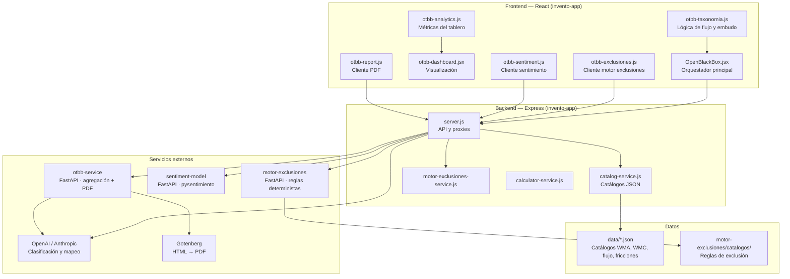
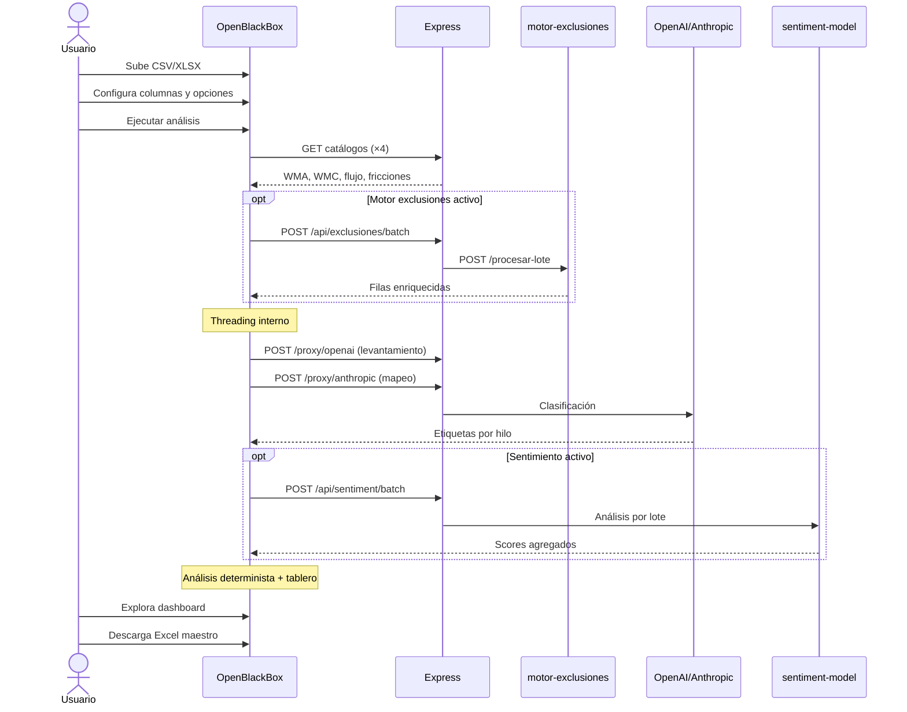
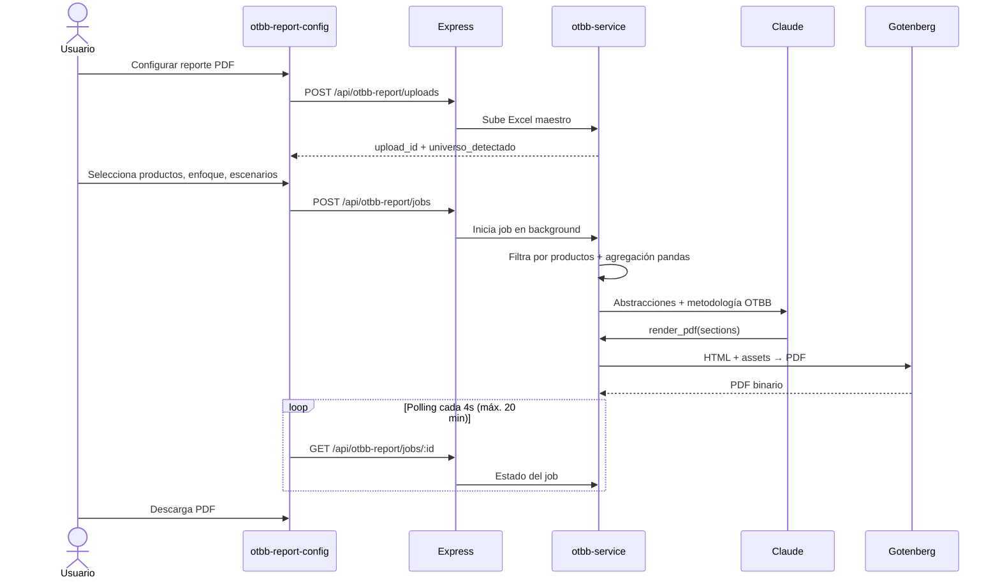

# OTBB — Open The Black Box

**Documentación técnica del módulo de análisis de conversaciones comerciales por correo**

Versión: invento-app · Wird  
Fecha: septiembre 2026

---

## Tabla de contenidos

1. [Resumen ejecutivo](#1-resumen-ejecutivo)
2. [Propósito y contexto de negocio](#2-propósito-y-contexto-de-negocio)
3. [Arquitectura general](#3-arquitectura-general)
4. [Componentes del sistema](#4-componentes-del-sistema)
5. [Pipeline de análisis](#5-pipeline-de-análisis)
6. [Flujo de trabajo del usuario](#6-flujo-de-trabajo-del-usuario)
7. [Taxonomía y lógica de negocio](#7-taxonomía-y-lógica-de-negocio)
8. [Integraciones externas](#8-integraciones-externas)
9. [Modelo de datos y exportaciones](#9-modelo-de-datos-y-exportaciones)
10. [Generación de reportes PDF](#10-generación-de-reportes-pdf)
11. [Principios de diseño](#11-principios-de-diseño)
12. [Configuración operativa](#12-configuración-operativa)

---

## 1. Resumen ejecutivo

**OTBB** (*Open The Black Box*) es la metodología y plataforma de Wird para analizar conversaciones comerciales por correo electrónico — principalmente en el sector bancario — con el objetivo de responder preguntas como:

- ¿En qué etapa del embudo comercial se pierden las conversaciones?
- ¿Qué fricciones operativas o de producto explican esas caídas?
- ¿Qué temas (tipificaciones) concentran el volumen y la fricción?
- ¿Cuál es el desenlace observable de cada conversación?

El módulo OTBB en **invento-app** es la capa interactiva del pipeline: el usuario sube un archivo de correos, configura el análisis, ejecuta el procesamiento automatizado y explora los resultados en un tablero analítico. Opcionalmente, puede exportar un Excel maestro y generar un reporte PDF ejecutivo mediante un servicio complementario.

El diseño sigue un principio central: **el LLM clasifica y redacta; el código determinístico calcula métricas, embudos y auditorías**. Los porcentajes y conteos nunca se delegan al modelo de lenguaje.

---

## 2. Propósito y contexto de negocio

### 2.1 Problema que resuelve

Las bases de correo comercial contienen miles de hilos con información valiosa mezclada con ruido operativo: respuestas automáticas, banners institucionales, historial citado repetido, buzones no monitoreados y conversaciones unilaterales. OTBB transforma ese caos en:

| Dimensión | Qué entrega |
|-----------|-------------|
| **Tipificación** | Códigos WMA (tema de negocio) y WMC (exclusión/residual) por conversación |
| **Flujo comercial** | Origen → Apertura → Gestión → Desenlace |
| **Fricciones** | Puntos de fricción identificados con evidencia textual |
| **Embudo** | Compuertas acumulativas desde base analizable hasta desenlace visible |
| **Sentimiento** | Score agregado por hilo (opcional) |
| **Reporte** | Excel maestro + PDF ejecutivo para el cliente |

### 2.2 Casos de uso típicos

- Análisis de gestión comercial por producto (crédito consumo, hipotecario, etc.)
- Diagnóstico de conversaciones outbound (campañas, persecución de demanda)
- Auditoría de calidad de respuesta y tiempos de gestión
- Identificación de fricciones documentales o de apertura
- Entrega de reportes PDF con narrativa metodológica para stakeholders

### 2.3 Alcance del módulo en invento-app

OTBB vive como una pestaña independiente dentro de invento-app (`OpenBlackBox`). No es un microservicio aislado: orquesta llamadas a catálogos locales, proxies de LLM, el motor de exclusiones, el modelo de sentimiento y, opcionalmente, el servicio de reportes PDF (`otbb-service`).

---

## 3. Arquitectura general

El sistema se organiza en **tres capas** con responsabilidades claramente separadas:



### 3.1 Diagrama de flujo de datos (alto nivel)

```
Archivo CSV/XLSX
      │
      ▼
┌─────────────────┐
│ Motor exclusiones│  ← opcional, determinista, pre-LLM
└────────┬────────┘
         ▼
┌─────────────────┐
│   Threading     │  ← agrupa mensajes en conversaciones
└────────┬────────┘
         ▼
┌─────────────────┐
│  Levantamiento  │  ← GPT extrae temas + Claude mapea a WMA
└────────┬────────┘
         ▼
┌─────────────────┐
│   Etiquetado    │  ← LLM clasifica flujo, fricciones, categoría
└────────┬────────┘
         ▼
┌─────────────────┐
│ WMB + Sentimiento│  ← opcionales
└────────┬────────┘
         ▼
┌─────────────────┐
│    Análisis     │  ← embudo, distribuciones, tablero
└────────┬────────┘
         ▼
   Excel maestro ──► otbb-service ──► PDF
```

---

## 4. Componentes del sistema

### 4.1 Frontend (React)

| Archivo | Responsabilidad |
|---------|-----------------|
| `OpenBlackBox.jsx` | Orquestador principal: UI, configuración, ejecución del pipeline, exportación Excel, lanzamiento de jobs PDF |
| `otbb-taxonomia.js` | Taxonomía cerrada de flujo comercial, compuertas del embudo, resolución determinista de Gestión/Apertura |
| `otbb-analytics.js` | Cálculo de KPIs, Sankey, fricciones por etapa, filtros por periodo/producto/canal |
| `otbb-dashboard.jsx` | Componente de visualización de resultados |
| `otbb-exclusiones.js` | Cliente HTTP al motor de exclusiones con batching por hilo |
| `otbb-sentiment.js` | Cliente HTTP al servicio de sentimiento con agregación por hilo |
| `otbb-report.js` | Upload, creación y polling de jobs de reporte PDF |
| `otbb-report-config.jsx` | Formulario de configuración del reporte (cliente, productos, enfoque) |
| `threading.js` | Construcción de hilos, transcripciones, métricas de respuesta |
| `invento.js` | Levantamiento de catálogo (`generateCatalogMappedMaster`) y clustering WMB |
| `App.jsx` | Punto de entrada: renderiza OTBB en la vista `blackbox` |

**Persistencia local:** el estado del pipeline se guarda en `localStorage` bajo la clave `otbb.cache.v2` (configuración, resultados, fase actual), de modo que una recarga del navegador no pierde el trabajo en curso.

### 4.2 Backend (Express)

| Archivo | Responsabilidad |
|---------|-----------------|
| `server.js` | Rutas API, proxies a servicios externos y LLMs |
| `catalog-service.js` | Carga y sirve catálogos JSON desde `data/` |
| `motor-exclusiones-service.js` | Proxy hacia `motor-exclusiones` |
| `calculator-service.js` | Estimación de costos/tokens del pipeline OTBB |

### 4.3 Catálogos de datos

| Archivo | Contenido |
|---------|-----------|
| `data/Catalogo_Banca.json` | Tipificaciones WMA con metadatos de negocio (producto, segmento, journey) |
| `data/Catalogo_exclusiones.json` | Códigos WMC de exclusión y categorías residuales |
| `data/Catalogo_definiciones.json` | Definiciones de campos para sugerencias WMB |
| `data/Definiciones_flujo.json` | Valores y prompts de Apertura, Gestión y Desenlace |
| `data/Definiciones_fricciones.json` | Taxonomía de fricciones (IDs `FR-XX-NN`) |

### 4.4 Servicio complementario: otbb-service

Proyecto hermano (`otbb-service/`) que consume el Excel maestro exportado desde invento-app y produce un reporte PDF ejecutivo. Su rol es **post-procesamiento y entrega**, no reemplaza el pipeline interactivo del frontend.

---

## 5. Pipeline de análisis

El pipeline se ejecuta en fases numeradas. Cada fase actualiza el indicador de progreso en la UI y persiste su estado en caché local.

### 5.1 Vista general de fases

| Fase | Código | Nombre | Descripción |
|------|--------|--------|-------------|
| 0 | `0` | Configuración | Usuario sube archivo y define parámetros |
| 1 | `1` | Catálogos | Carga paralela de 4 catálogos vía API |
| 1.7 | `1.7` | Exclusiones | Motor determinista de ruido operativo *(opcional)* |
| — | *(interno)* | Threading | Agrupación de mensajes en conversaciones |
| 2 | `2` | Levantamiento | Extracción de temas + mapeo al catálogo WMA |
| 3 | `3` | Etiquetado | Clasificación LLM de flujo, fricciones y categoría |
| 3.5 | `3.5` | WMB | Categorías emergentes para "Otros" *(opcional)* |
| 3.7 | `3.7` | Sentimiento | Análisis de sentimiento por hilo *(opcional)* |
| 4 | `4` | Análisis | Construcción de distribuciones y proyecciones |
| 5 | `5` | Listo | Tablero, exportación y reporte PDF disponibles |

### 5.2 Detalle por fase

#### Fase 0 — Configuración

Antes de ejecutar el pipeline, el usuario define:

- **Archivo de entrada:** CSV o XLSX (máx. 25 MB; `.xls` no soportado)
- **Unidad de análisis:**
  - `message` — clasificación mensaje a mensaje
  - `thread` — clasificación por conversación *(modo principal OTBB)*
- **Columnas del archivo:** ID de conversación, fecha, dirección, asunto, contenido, destinatario
- **Modelo LLM:** GPT-4.1, GPT-5.2, GPT-5.6-luna o Claude Sonnet 5
- **Opciones:** motor de exclusiones, sentimiento, WMB (categorías emergentes)

En modo conversación, un **pre-análisis** previo construye un resumen de hilos y, si el motor de exclusiones está activo, muestra estadísticas de exclusión antes de consumir tokens de LLM.

#### Fase 1 — Carga de catálogos

Se obtienen en paralelo cuatro catálogos desde el backend:

```
GET /api/catalog/banca-master    → WMA + metaMap
GET /api/catalog/exclusiones     → WMC + metaMap
GET /api/catalog/flujo           → definiciones de flujo comercial
GET /api/catalog/fricciones      → taxonomía de fricciones
```

Estos catálogos alimentan tanto los prompts del LLM como la lógica determinista post-etiquetado.

#### Fase 1.7 — Motor de exclusiones *(opcional)*

Capa **determinista y pre-LLM** que marca ruido operativo mensaje por mensaje:

- Fuera de oficina y respuestas automáticas
- Rebotes y acuses de recibo
- Banners institucionales (CMF, phishing, etc.)
- Filas duplicadas por defecto de exportación
- Insistencias (cliente que reescribe sin respuesta)

**Importante:** esta capa es aditiva — no borra ni reordena filas. Agrega columnas internas (`__exclusion_*`) que `threading.js` usa para construir el texto limpio del prompt.

> **Distinción clave:** el motor de exclusiones (reglas CSV, sin IA) es distinto de las categorías WMC que el LLM asigna durante el etiquetado (ej. auto-respuestas detectadas en la transcripción).

#### Threading *(interno, post-exclusiones)*

`threading.js` transforma filas de mensajes en **filas de conversación**:

- `transcript_hilo` — transcripción ordenada de la conversación
- `composicion_hilo` — `mixto` / `inbound` / `outbound` / `interno`
- `iniciado_por` — cliente o ejecutivo (determina Origen)
- Métricas de tiempo de respuesta, fechas de inicio/fin, conteos

#### Fase 2 — Levantamiento de catálogo

Proceso en dos pasos:

1. **GPT** extrae temáticas emergentes de una muestra de transcripciones
2. **Claude** mapea esas temáticas a códigos WMA del catálogo bancario (máx. 45 WMA activos)

Resultado: un **maestro filtrado** con solo las categorías relevantes para el dataset analizado, reduciendo ruido en el etiquetado posterior.

#### Fase 3 — Etiquetado

El LLM clasifica cada conversación (modo thread) o mensaje (modo message). En modo conversación, un solo prompt por hilo devuelve:

| Campo | Descripción |
|-------|-------------|
| `CategoriaAsignada` | Código WMA o WMC |
| `Confianza` / `Evidencia` | Score y cita textual |
| `Apertura` | Tipo de apertura comercial |
| `Gestion` | Etapa de gestión documental |
| `Desenlace` | Resultado observable |
| `Fricciones` | IDs de fricción con turno y evidencia |

**Parámetros de batching:**

| Modo | Tamaño de lote | Concurrencia |
|------|----------------|--------------|
| Mensaje | 10 | 4 |
| Conversación | 5 | 2 |
| Exclusiones | ≤4000 msgs (por hilo) | 2 |
| Sentimiento | 150 | 3 |

#### Fase 3.5 — WMB *(opcional)*

Para conversaciones clasificadas como `WMA000` ("Otros"), se ejecuta un clustering emergente que propone subcategorías WMB específicas del dataset, seguido de un re-etiquetado.

#### Fase 3.7 — Sentimiento *(opcional)*

El servicio `sentiment-model` analiza el `clean_text` de cada mensaje y agrega un score de sentimiento a nivel de hilo (`SentimentHilo`, `overall_sentiment_score`).

#### Fase 4 — Análisis

Se construyen:

- Distribución de categorías (WMA/WMC)
- Proyecciones de journey, segmento y producto desde metadatos del catálogo
- Estado de flujo reconciliado (`conversationFlowState`)
- Compuertas del embudo (`funnelGates`)
- Señales WMC y fricciones por etapa

#### Fase 5 — Resultados

El tablero analítico queda disponible con:

- KPIs principales y filtros interactivos
- Diagrama Sankey del flujo comercial
- Fricciones agrupadas por etapa del embudo
- Exportación a Excel maestro
- Configuración de reporte PDF

---

## 6. Flujo de trabajo del usuario

### 6.1 Flujo principal (análisis interactivo)



### 6.2 Pasos del usuario

1. **Acceder** a la pestaña OTBB en invento-app
2. **Subir** el archivo de correos exportado del CRM o plataforma de email
3. **Mapear columnas** del archivo a los campos requeridos
4. **Configurar** modelo LLM, motor de exclusiones, sentimiento y WMB
5. **Revisar** el pre-análisis (conteo de hilos, preview de exclusiones)
6. **Ejecutar** el pipeline y monitorear el progreso por fase
7. **Explorar** el tablero: filtros, Sankey, fricciones, distribuciones
8. **Exportar** el Excel maestro (`maestro_otbb.xlsx`)
9. *(Opcional)* **Generar reporte PDF** para entrega al cliente

---

## 7. Taxonomía y lógica de negocio

La taxonomía OTBB está implementada como **enums cerrados** en `otbb-taxonomia.js`. Los valores deben coincidir byte a byte entre invento-app y otbb-service.

### 7.1 Dimensiones del flujo comercial

| Dimensión | Origen | Valores ejemplo |
|-----------|--------|-----------------|
| **Origen** | Metadata del hilo (quién envió el primer correo) | Inbound, Outbound |
| **Apertura** | LLM (restringido por Origen) | Inbound frío, Campañas de marketing, Sin respuesta del cliente… |
| **Gestión** | LLM + reglas deterministas | Conversación neta, Caso comercial activo, Huérfana… |
| **Desenlace** | LLM | Colocación verificada, Rechazada por riesgo, Sin desenlace visible… |
| **Fricciones** | LLM + catálogo | IDs `FR-EC-02`, `FR-DO-01`, etc. |

### 7.2 Resolución determinista

Algunos campos **no se delegan al LLM** cuando la metadata del hilo ya resuelve el valor:

- **Origen** → derivado de `iniciado_por` (cliente = Inbound, ejecutivo = Outbound)
- **Gestión en hilos unilaterales:**
  - Solo inbound → "Cliente escribió y nadie respondió (huérfana)"
  - Solo outbound/interno → "Sin gestión (unilateral del banco)"
- **Conversación neta** → solo hilos con `composicion_hilo === 'mixto'` (ambos lados participaron)

Esta reconciliación garantiza que las compuertas del embudo sean consistentes: `base ≥ neta ≥ casoActivo ≥ desenlaceVisible`.

### 7.3 Compuertas del embudo

El embudo es **acumulativo**: cada porcentaje se calcula sobre la base analizable, no sobre el paso anterior.

| Compuerta | Criterio |
|-----------|----------|
| **Base analizable** | Conversaciones cuyo desenlace no es "Fuera del análisis" |
| **Conversación neta** | Base + composición bilateral (cliente y banco participaron) |
| **Caso comercial activo** | Neta + entró a gestión documental |
| **Desenlace visible** | Caso activo + desenlace observable (no "invisible") |

### 7.4 Namespaces de códigos

| Prefijo | Significado | Fuente |
|---------|-------------|--------|
| **WMA** | Tipificación de tema de negocio | Catálogo bancario + WMB emergente |
| **WMC** | Exclusión o categoría residual | Catálogo de exclusiones + LLM |
| **WMB** | Categoría emergente para "Otros" | Clustering sobre `WMA000` |
| **FR-XX-NN** | Fricción identificada | Catálogo de fricciones |

---

## 8. Integraciones externas

### 8.1 motor-exclusiones

| Aspecto | Detalle |
|---------|---------|
| **Tipo** | FastAPI, reglas deterministas (sin LLM) |
| **Cuándo corre** | Fase 1.7, antes del threading |
| **Entrada** | Filas crudas del archivo con columnas de hilo |
| **Salida** | Mismas filas + columnas `__exclusion_*` |
| **Catálogo** | `motor-exclusiones/catalogos/exclusiones.csv` (~105 reglas) |
| **Endpoint** | `POST /procesar-lote` (proxy: `/api/exclusiones/batch`) |

Pipeline interno del motor (5 etapas):

1. Agrupar por hilo y ordenar por fecha
2. Quitar bloques institucionales del texto
3. Clasificar duplicados vs. insistencias
4. Deduplicar historial citado
5. Aplicar catálogo de reglas sobre texto original

### 8.2 sentiment-model

| Aspecto | Detalle |
|---------|---------|
| **Tipo** | FastAPI con `pysentimiento` |
| **Cuándo corre** | Fase 3.7, post-etiquetado |
| **Entrada** | `clean_text` por mensaje |
| **Salida** | Score agregado por hilo |
| **Endpoint** | `POST /api/sentiment/batch` |

### 8.3 LLMs (OpenAI / Anthropic)

| Uso | Modelo típico | Fase |
|-----|---------------|------|
| Extracción de temas | GPT | 2 |
| Mapeo a catálogo WMA | Claude | 2 |
| Etiquetado de conversaciones | Configurable por usuario | 3 |
| Clustering WMB | GPT | 3.5 |
| Redacción de reporte PDF | Claude Sonnet 5 | otbb-service |

Proxies en Express: `/proxy/openai`, `/proxy/anthropic`.

### 8.4 otbb-service + Gotenberg

| Aspecto | Detalle |
|---------|---------|
| **otbb-service** | Agregación determinista + agente Claude + render PDF |
| **Gotenberg** | Conversión HTML → PDF (servicio externo) |
| **Contrato** | Excel maestro → PDF ejecutivo |

---

## 9. Modelo de datos y exportaciones

### 9.1 Archivo de entrada

Formatos soportados: **CSV**, **XLSX**. Columnas inferidas automáticamente:

- ID de conversación / hilo
- Fecha
- Dirección (inbound/outbound)
- Asunto
- Contenido / cuerpo
- Remitente, destinatario, ID de mensaje *(opcionales)*

### 9.2 Fila de conversación (post-threading)

Campos clave generados por `threading.js`:

```
thread_id, transcript_hilo, fecha_inicio, fecha_fin,
composicion_hilo, iniciado_por, Origen,
metricas_respuesta, conteos_exclusion
```

### 9.3 Fila etiquetada (post-LLM)

Campos adicionales del etiquetado:

```
CategoriaAsignada, Confianza, Evidencia,
Apertura, Gestion, Desenlace,
Fricciones, MacroFricciones, FriccionIniciaEnHilo,
JourneyConversacional, SegmentoNegocio, ProductoNegocio,
SentimentHilo, overall_sentiment_score
```

### 9.4 Excel maestro (`maestro_otbb.xlsx`)

| Hoja | Contenido |
|------|-----------|
| `Data_maestro` | Maestro de categorías con N, % y ejemplos |
| `Datos_etiquetados` | Filas completas etiquetadas *(input principal de otbb-service)* |
| `Distribucion` | Distribución por categoría |
| `Detalle_hilos` | Detalle mensaje a mensaje dentro de cada hilo |
| `Exclusiones` | Señales del motor de exclusiones |
| `Señales_WMC` | Códigos WMC por hilo |
| `Flujo_conversacional` | Estado de flujo por hilo |
| `Funnel_gestion` | Conteos de compuertas del embudo |

---

## 10. Generación de reportes PDF

El flujo de reporte PDF es **opcional** y requiere que `otbb-service` esté desplegado y accesible.

### 10.1 Flujo end-to-end



### 10.2 Configuración del reporte (ReportConfig)

```json
{
  "cliente": "Nombre del cliente",
  "periodo_label": "Junio 2026",
  "upload_id": "...",
  "productos_seleccionados": ["Crédito Consumo"],
  "enfoque": "gestion | originacion | ambos",
  "tasa_conversion": "observada | escenarios | auto",
  "escenarios_recuperacion": {
    "pesimista": 0.05,
    "conservador": 0.10,
    "ideal": 0.20
  },
  "poblacion_total_mensual": null,
  "n_ejecutivos_o_buzones": null,
  "notas_cliente": null
}
```

### 10.3 Principios del servicio PDF

- **El LLM redacta, no calcula:** recibe un JSON de abstracciones ya calculadas (embudo, fricciones, auditorías)
- **HTML sobre shell fijo:** el sistema de diseño Wird (fuentes, colores, logo) es inyectado; Claude solo genera el contenido interno de cada sección
- **Selección de productos del usuario:** el universo se detecta del archivo; el usuario elige el subconjunto a analizar
- **Render desacoplado:** Gotenberg convierte HTML a PDF como servicio independiente

---

## 11. Principios de diseño

### 11.1 Separación LLM vs. código determinista

| Tarea | Responsable |
|-------|-------------|
| Clasificar tema, flujo, fricciones | LLM |
| Calcular embudo, porcentajes, auditorías | Código (`otbb-taxonomia.js`, `otbb-analytics.js`) |
| Filtrar ruido operativo pre-LLM | Motor de exclusiones (reglas) |
| Redactar narrativa del reporte | LLM (sobre abstracciones pre-calculadas) |
| Renderizar PDF | Gotenberg (HTML fijo + contenido LLM) |

### 11.2 Resiliencia

- El motor de exclusiones es **aditivo**: si falla, el pipeline continúa con datos crudos
- WMB y sentimiento son **opcionales**: su fallo no detiene el análisis principal
- El estado se **persiste en localStorage** para recuperación ante recargas
- El pre-análisis de exclusiones se **cachea** para evitar doble procesamiento

### 11.3 Trazabilidad

- Cada compuerta del embudo tiene **linaje documentado** hacia los valores del catálogo (`GATE_LINEAGE`)
- Las fricciones incluyen **turno y evidencia textual**
- Las tipificaciones incluyen **score de confianza y cita**

### 11.4 Sincronización de contratos

Los enums en español (Apertura, Gestión, Desenlace) deben mantenerse **idénticos** entre:

- `invento-app/src/otbb-taxonomia.js`
- `otbb-service/app/ingestion/parser.py`

Cualquier cambio en uno requiere actualización en el otro.

---

## 12. Configuración operativa

### 12.1 Variables de entorno (invento-app)

| Variable | Propósito | Requerida |
|----------|-----------|-----------|
| `OPENAI_KEY` | Levantamiento GPT + etiquetado | Sí |
| `ANTHROPIC_API_KEY` | Mapeo Claude + etiquetado opcional | Sí |
| `MOTOR_EXCLUSIONES_URL` | URL del motor de exclusiones | Para exclusiones |
| `MOTOR_EXCLUSIONES_API_KEY` | API key del motor | Opcional |
| `SENTIMENT_API_URL` | URL del servicio de sentimiento | Para sentimiento |
| `OTBB_SERVICE_URL` | URL de otbb-service | Para PDF |
| `OTBB_SERVICE_TIMEOUT_MS` | Timeout del proxy PDF (default: 60000) | Opcional |
| `PORT` / `VITE_PROXY_PORT` | Puerto del backend Express | Dev |

### 12.2 Variables de entorno (otbb-service)

| Variable | Propósito |
|----------|-----------|
| `GOTENBERG_URL` | URL de Gotenberg (default: `http://localhost:8090`) |
| `ANTHROPIC_API_KEY` | Claude para redacción del reporte |
| `ANTHROPIC_MODEL` | Modelo Claude (default: `claude-sonnet-5`) |
| `INTERNAL_BASE_URL` | URL base para que el agente llame a `/render` |

### 12.3 Checklist de despliegue

**Pipeline interactivo (invento-app):**

- [ ] Backend Express con claves OpenAI y Anthropic
- [ ] Catálogos JSON presentes en `invento-app/data/`
- [ ] *(Opcional)* motor-exclusiones corriendo (puerto 8095)
- [ ] *(Opcional)* sentiment-model corriendo

**Reporte PDF:**

- [ ] otbb-service desplegado con `ANTHROPIC_API_KEY`
- [ ] Gotenberg accesible (Docker local o servicio remoto)
- [ ] `OTBB_SERVICE_URL` configurado en invento-app
- [ ] otbb-service ejecutado **sin `--reload`** durante generación de PDFs (evita pérdida de estado de jobs)

### 12.4 Endpoints API relevantes

| Método | Ruta | Descripción |
|--------|------|-------------|
| GET | `/api/catalog/banca-master` | Catálogo WMA |
| GET | `/api/catalog/exclusiones` | Catálogo WMC |
| GET | `/api/catalog/flujo` | Definiciones de flujo |
| GET | `/api/catalog/fricciones` | Catálogo de fricciones |
| POST | `/api/exclusiones/batch` | Proxy motor de exclusiones |
| POST | `/api/sentiment/batch` | Proxy sentimiento |
| POST | `/proxy/openai` | Proxy OpenAI |
| POST | `/proxy/anthropic` | Proxy Anthropic |
| POST | `/api/otbb-report/uploads` | Subir Excel maestro |
| POST | `/api/otbb-report/jobs` | Crear job de reporte |
| GET | `/api/otbb-report/jobs/:id` | Estado del job |
| GET | `/api/otbb-report/jobs/:id/pdf` | Descargar PDF |
| POST | `/api/calculator/otbb` | Estimar costos/tokens |

---

## Apéndice A — Mapa de archivos clave

```
invento-app/
├── src/
│   ├── OpenBlackBox.jsx          # Orquestador principal
│   ├── otbb-taxonomia.js         # Taxonomía y embudo
│   ├── otbb-analytics.js         # Métricas del tablero
│   ├── otbb-dashboard.jsx        # UI de resultados
│   ├── otbb-exclusiones.js       # Cliente motor exclusiones
│   ├── otbb-sentiment.js         # Cliente sentimiento
│   ├── otbb-report.js            # Cliente PDF
│   ├── otbb-report-config.jsx      # Config reporte PDF
│   ├── threading.js              # Construcción de hilos
│   └── invento.js                # Levantamiento de catálogo
├── data/
│   ├── Catalogo_Banca.json
│   ├── Catalogo_exclusiones.json
│   ├── Definiciones_flujo.json
│   └── Definiciones_fricciones.json
├── server.js                     # API y proxies
├── catalog-service.js
├── motor-exclusiones-service.js
└── calculator-service.js

otbb-service/                     # Servicio complementario PDF
├── app/
│   ├── main.py
│   ├── ingestion/                # Parser + agregación
│   ├── llm/                      # Agente Claude
│   └── rendering/                # Shell HTML + Gotenberg
└── docs/
    └── PROMPT_OTBB_REUTILIZABLE.md

motor-exclusiones/                  # Servicio de pre-filtrado
├── motor/pipeline.py
└── catalogos/exclusiones.csv
```

---

## Apéndice B — Glosario

| Término | Definición |
|---------|------------|
| **OTBB** | Open The Black Box — metodología de análisis de conversaciones comerciales |
| **WMA** | Código de tipificación de tema de negocio |
| **WMC** | Código de exclusión o categoría residual |
| **WMB** | Categoría emergente generada para conversaciones "Otros" |
| **Hilo / Thread** | Conversación completa agrupada por ID |
| **Compuerta** | Etapa acumulativa del embudo comercial |
| **Fricción** | Punto de dificultad identificado en la conversación |
| **Levantamiento** | Proceso de adaptar el catálogo WMA al dataset específico |
| **Maestro** | Conjunto de categorías activas para el etiquetado |
| **Abstracciones** | JSON de métricas pre-calculadas para el reporte PDF |

---

*Documento generado a partir del código fuente de invento-app y sus servicios integrados.*
